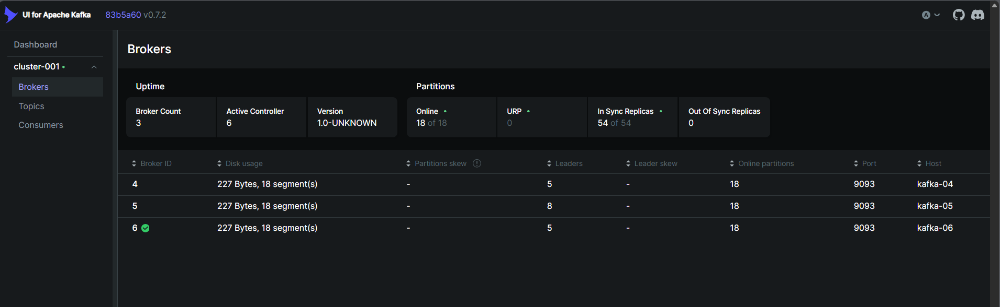

# Kafka installation with systemd

## Menu
- [Lab info](#lab-info-3-controller-3-broker)
- [Config hosts file](#config-hosts-file-on-all-nodes-controller--broker)
- [Install & Pre-config](#install--pre-config-on-all-nodes-controller--broker)
- [Config controller nodes](#config-controller-nodes)
  - [Controller 01](#on-node-kafka-controller-01)
  - [Controller 02](#on-node-kafka-controller-02)
  - [Controller 03](#on-node-kafka-controller-03)
- [Config broker nodes](#config-broker-nodes)
  - [Broker 01](#on-node-kafka-broker-01)
  - [Broker 02](#on-node-kafka-broker-02)
  - [Broker 03](#on-node-kafka-broker-03)
- [Deploy Kafka UI (optional)](#Deploy-Kafka-UI)
- [Expose Kafka JMX metrics (optional)](#Expose-Kafka-JMX-metrics)

> [!TIP]
> **Minimum requirement: 3 nodes controller & 3 nodes broker**

## Lab info (3 controller, 3 broker)
| Hostname | IP Address | OS | Role | Node ID | Proxy Public IP |
| :--- | :--- | :--- | :--- | :--- | :--- |
| kafka-controller-01 | 172.31.16.254 | Ubuntu 22.04.5 LTS | controller | 1 | - |
| kafka-controller-02 | 172.31.17.55 | Ubuntu 22.04.5 LTS | controller | 2 | - |
| kafka-controller-03 | 172.31.31.137 | Ubuntu 22.04.5 LTS | controller | 3 | - |
| kafka-broker-01 | 172.31.31.153 | Ubuntu 22.04.5 LTS | broker | 4 | 13.229.133.147 |
| kafka-broker-02 | 172.31.16.244 | Ubuntu 22.04.5 LTS | broker | 5 | 13.229.133.147 |
| kafka-broker-03 | 172.31.16.215 | Ubuntu 22.04.5 LTS | broker | 6 | 13.229.133.147 |

## Config hosts file on all nodes (controller & broker)
```
# vi /etc/hosts

172.31.16.254 kafka-01 kafka-controller-01
172.31.17.55 kafka-02 kafka-controller-02
172.31.31.137 kafka-03 kafka-controller-03
172.31.31.153 kafka-04 kafka-broker-01
172.31.16.244 kafka-05 kafka-broker-02
172.31.16.215 kafka-06 kafka-broker-03
```

## Install & pre-config on all nodes (controller & broker)
**Change default values system limit**
```
# vi /etc/systemd/system.conf

DefaultLimitNOFILE=65000
DefaultLimitNPROC=65000
DefaultTasksMax=65000
```

**Config sysctl.conf**
```
# vi /etc/sysctl.conf

net.ipv4.ip_forward=1
kernel.randomize_va_space=2
fs.suid_dumpable=0
kernel.keys.root_maxbytes=25000000
kernel.keys.root_maxkeys=1000000
kernel.panic=10
kernel.panic_on_oops=1
vm.overcommit_memory=1
vm.panic_on_oom=0
fs.inotify.max_user_watches=524288
fs.inotify.max_user_instances=1024
```

```
# sysctl -p --system
```

**Prepare package components:**
```
# apt update && apt install openjdk-17-jdk -y
# useradd kafka -m
# cd /opt
# wget https://downloads.apache.org/kafka/4.1.1/kafka_2.13-4.1.1.tgz
# tar -xvf kafka_2.13-4.1.1.tgz
# mv kafka_2.13-4.1.1 kafka
# chown -R kafka:kafka /opt/kafka
# mkdir -p /var/lib/kafka/controller/{data,logs} /var/lib/kafka/broker/{data,logs}
# chown -R kafka:kafka /var/lib/kafka
```

## Config controller nodes
### On node kafka-controller-01
**Generate Cluster ID (only generate once and reuse for all remain nodes)**
```
# /opt/kafka/bin/kafka-storage.sh random-uuid

421j_LOSTrioyErqtEZMVA
```

> [!NOTE]
> **Cluster ID only generate once and reuse for all remain nodes**

**Apply controller config:**
```
# mv /opt/kafka/config/controller.properties /opt/kafka/config/controller.properties.ori
```

```
# vi /opt/kafka/config/controller.properties

listeners=CONTROLLER://:9094
listener.security.protocol.map=INTERNAL:SASL_PLAINTEXT,CONTROLLER:PLAINTEXT
process.roles=controller
node.id=1
controller.listener.names=CONTROLLER
controller.quorum.voters=1@kafka-controller-01:9094,2@kafka-controller-02:9094,3@kafka-controller-03:9094
controller.quorum.bootstrap.servers=kafka-controller-01:9094,kafka-controller-02:9094,kafka-controller-03:9094
log.dir=/var/lib/kafka/controller/data
logs.dir=/var/lib/kafka/controller/logs
num.network.threads=3
num.io.threads=8
inter.broker.listener.name=INTERNAL
group.initial.rebalance.delay.ms=0
offsets.topic.replication.factor=3
default.replication.factor=3
min.insync.replicas=2
```

```
# chown kafka:kafka /opt/kafka/config/controller.properties
```

```
# /opt/kafka/bin/kafka-storage.sh format --config /opt/kafka/config/controller.properties --cluster-id <CLUSTER ID>

Example: 
# /opt/kafka/bin/kafka-storage.sh format --config /opt/kafka/config/controller.properties --cluster-id 421j_LOSTrioyErqtEZMVA
Formatting metadata directory /var/lib/kafka/controller/data with metadata.version 4.1-IV1.
```

**Defined kafka-control systemd service:**
```
# vi /etc/systemd/system/kafka-controller.service

[Unit]
Description=Kafka KRaft Controller
After=network.target

[Service]
Environment="KAFKA_OPTS=-Dcom.sun.management.jmxremote \
 -Dcom.sun.management.jmxremote.port=9999 \
 -Dcom.sun.management.jmxremote.rmi.port=9999 \
 -Dcom.sun.management.jmxremote.authenticate=false \
 -Dcom.sun.management.jmxremote.ssl=false \
 -Djava.rmi.server.hostname=kafka-controller-01"
User=kafka
WorkingDirectory=/opt/kafka
ExecStart=/opt/kafka/bin/kafka-server-start.sh /opt/kafka/config/controller.properties
Restart=on-failure
LimitNOFILE=100000

[Install]
WantedBy=multi-user.target
```

```
# systemctl daemon-reload

# systemctl start kafka-controller && systemctl enable kafka-controller

# systemctl status kafka-controller
● kafka-controller.service - Kafka KRaft Controller
     Loaded: loaded (/etc/systemd/system/kafka-controller.service; enabled; vendor preset: enabled)
     Active: active (running) since Wed 2025-11-19 04:06:36 UTC; 36s ago
   Main PID: 4865 (java)
      Tasks: 52 (limit: 65000)
     Memory: 208.0M
        CPU: 5.743s
     CGroup: /system.slice/kafka-controller.service
             └─4865 java -Xmx1G -Xms1G -server -XX:+UseG1GC -XX:MaxGCPauseMillis=20 -XX:InitiatingHeapOccupancyPercent=35 -XX:+ExplicitGCInvokesConcurrent -XX:MaxInlineLevel=15 -Djava.awt.headless=true "-Xlog>
```

### On node kafka-controller-02
**Apply controller config:**
```
# mv /opt/kafka/config/controller.properties /opt/kafka/config/controller.properties.ori
```

```
# vi /opt/kafka/config/controller.properties

listeners=CONTROLLER://:9094
listener.security.protocol.map=INTERNAL:SASL_PLAINTEXT,CONTROLLER:PLAINTEXT
process.roles=controller
node.id=2
controller.listener.names=CONTROLLER
controller.quorum.voters=1@kafka-controller-01:9094,2@kafka-controller-02:9094,3@kafka-controller-03:9094
controller.quorum.bootstrap.servers=kafka-controller-01:9094,kafka-controller-02:9094,kafka-controller-03:9094
log.dir=/var/lib/kafka/controller/data
logs.dir=/var/lib/kafka/controller/logs
num.network.threads=3
num.io.threads=8
inter.broker.listener.name=INTERNAL
group.initial.rebalance.delay.ms=0
offsets.topic.replication.factor=3
default.replication.factor=3
min.insync.replicas=2
```

> [!NOTE]
> **Keep all configs on kafka-controller-01. Only increase "node.id"**

```
# chown kafka:kafka /opt/kafka/config/controller.properties
```

```
# /opt/kafka/bin/kafka-storage.sh format --config /opt/kafka/config/controller.properties --cluster-id <CLUSTER ID>

Example:
# /opt/kafka/bin/kafka-storage.sh format --config /opt/kafka/config/controller.properties --cluster-id 421j_LOSTrioyErqtEZMVA
Formatting metadata directory /var/lib/kafka/controller/data with metadata.version 4.1-IV1.
```

**Defined kafka-control systemd service:**
```
# vi /etc/systemd/system/kafka-controller.service

[Unit]
Description=Kafka KRaft Controller
After=network.target

[Service]
Environment="KAFKA_OPTS=-Dcom.sun.management.jmxremote \
 -Dcom.sun.management.jmxremote.port=9999 \
 -Dcom.sun.management.jmxremote.rmi.port=9999 \
 -Dcom.sun.management.jmxremote.authenticate=false \
 -Dcom.sun.management.jmxremote.ssl=false \
 -Djava.rmi.server.hostname=kafka-controller-02"
User=kafka
WorkingDirectory=/opt/kafka
ExecStart=/opt/kafka/bin/kafka-server-start.sh /opt/kafka/config/controller.properties
Restart=on-failure
LimitNOFILE=100000

[Install]
WantedBy=multi-user.target
```

```
# systemctl daemon-reload

# systemctl start kafka-controller && systemctl enable kafka-controller

# systemctl status kafka-controller
● kafka-controller.service - Kafka KRaft Controller
     Loaded: loaded (/etc/systemd/system/kafka-controller.service; enabled; vendor preset: enabled)
     Active: active (running) since Wed 2025-11-19 04:14:02 UTC; 4s ago
   Main PID: 3246 (java)
      Tasks: 52 (limit: 65000)
     Memory: 224.3M
        CPU: 5.433s
     CGroup: /system.slice/kafka-controller.service
             └─3246 java -Xmx1G -Xms1G -server -XX:+UseG1GC -XX:MaxGCPauseMillis=20 -XX:InitiatingHeapOccupancyPercent=35 -XX:+ExplicitGCInvokesConcurrent -XX:MaxInlineLevel=15 -Djava.awt.headless=true "-Xlog>

```

### On node kafka-controller-03
**Apply controller config:**
```
# mv /opt/kafka/config/controller.properties /opt/kafka/config/controller.properties.ori
```

```
# vi /opt/kafka/config/controller.properties

listeners=CONTROLLER://:9094
listener.security.protocol.map=INTERNAL:SASL_PLAINTEXT,CONTROLLER:PLAINTEXT
process.roles=controller
node.id=3
controller.listener.names=CONTROLLER
controller.quorum.voters=1@kafka-controller-01:9094,2@kafka-controller-02:9094,3@kafka-controller-03:9094
controller.quorum.bootstrap.servers=kafka-controller-01:9094,kafka-controller-02:9094,kafka-controller-03:9094
log.dir=/var/lib/kafka/controller/data
logs.dir=/var/lib/kafka/controller/logs
num.network.threads=3
num.io.threads=8
inter.broker.listener.name=INTERNAL
group.initial.rebalance.delay.ms=0
offsets.topic.replication.factor=3
default.replication.factor=3
min.insync.replicas=2
```

> [!NOTE]
> **Keep all configs on kafka-controller-02. Only increase "node.id"**

```
# chown kafka:kafka /opt/kafka/config/controller.properties
```

```
# /opt/kafka/bin/kafka-storage.sh format --config /opt/kafka/config/controller.properties --cluster-id <CLUSTER ID>

Example:
# /opt/kafka/bin/kafka-storage.sh format --config /opt/kafka/config/controller.properties --cluster-id 421j_LOSTrioyErqtEZMVA
Formatting metadata directory /var/lib/kafka/controller/data with metadata.version 4.1-IV1.
```

**Defined kafka-control systemd service:**
```
# vi /etc/systemd/system/kafka-controller.service

[Unit]
Description=Kafka KRaft Controller
After=network.target

[Service]
Environment="KAFKA_OPTS=-Dcom.sun.management.jmxremote \
 -Dcom.sun.management.jmxremote.port=9999 \
 -Dcom.sun.management.jmxremote.rmi.port=9999 \
 -Dcom.sun.management.jmxremote.authenticate=false \
 -Dcom.sun.management.jmxremote.ssl=false \
 -Djava.rmi.server.hostname=kafka-controller-03"
User=kafka
WorkingDirectory=/opt/kafka
ExecStart=/opt/kafka/bin/kafka-server-start.sh /opt/kafka/config/controller.properties
Restart=on-failure
LimitNOFILE=100000

[Install]
WantedBy=multi-user.target
```


```
# systemctl daemon-reload

# systemctl start kafka-controller && systemctl enable kafka-controller

# systemctl status kafka-controller
● kafka-controller.service - Kafka KRaft Controller
     Loaded: loaded (/etc/systemd/system/kafka-controller.service; enabled; vendor preset: enabled)
     Active: active (running) since Wed 2025-11-19 04:18:58 UTC; 4s ago
   Main PID: 3334 (java)
      Tasks: 52 (limit: 65000)
     Memory: 220.9M
        CPU: 4.953s
     CGroup: /system.slice/kafka-controller.service
             └─3334 java -Xmx1G -Xms1G -server -XX:+UseG1GC -XX:MaxGCPauseMillis=20 -XX:InitiatingHeapOccupancyPercent=35 -XX:+ExplicitGCInvokesConcurrent -XX:MaxInlineLevel=15 -Djava.awt.headless=true "-Xlog>
```

## Config broker nodes

| LISTENER | USERNAME | PASSWORD |
| :--- | :--- | :--- |
| CLIENT://:9092 | admin | Enjoyd@y |
| INTERNAL://:9093 | admin | Enjoyd@y2025 |

### On node kafka-broker-01
**Apply broker config:**
```
# mv /opt/kafka/config/broker.properties /opt/kafka/config/broker.properties.ori
```


> [!TIP]
> Replace "CLIENT://13.229.133.147:9092" with IP proxy allow connect for client.
```
# vi /opt/kafka/config/broker.properties

advertised.listeners=INTERNAL://:9093,CLIENT://13.229.133.147:9092
inter.broker.listener.name=INTERNAL
controller.quorum.voters=1@kafka-controller-01:9094,2@kafka-controller-02:9094,3@kafka-controller-03:9094
controller.listener.names=CONTROLLER
controller.quorum.bootstrap.servers=kafka-controller-01:9094,kafka-controller-02:9094,kafka-controller-03:9094
log.dirs=/var/lib/kafka/broker/data/
group.initial.rebalance.delay.ms=0
default.replication.factor=3
offsets.topic.replication.factor=3
min.insync.replicas=2
num.network.threads=3
num.io.threads=8
listeners=CLIENT://:9092,INTERNAL://:9093
sasl.mechanism.inter.broker.protocol=PLAIN
listener.security.protocol.map=CLIENT:SASL_PLAINTEXT,INTERNAL:SASL_PLAINTEXT,CONTROLLER:PLAINTEXT
sasl.enabled.mechanisms=PLAIN
node.id=4
process.roles=broker
listener.name.client.plain.sasl.jaas.config=org.apache.kafka.common.security.plain.PlainLoginModule required user_admin="Enjoyd@y";
listener.name.internal.plain.sasl.jaas.config=org.apache.kafka.common.security.plain.PlainLoginModule required username="admin" password="Enjoyd@y2025" user_admin="Enjoyd@y2025";
```

> [!NOTE]
> **"node.id" should be unique value !**

```
# chown kafka:kafka /opt/kafka/config/broker.properties
```

```
# /opt/kafka/bin/kafka-storage.sh format --config /opt/kafka/config/broker.properties --cluster-id <CLUSTER ID>

Example:
# /opt/kafka/bin/kafka-storage.sh format --config /opt/kafka/config/broker.properties --cluster-id 421j_LOSTrioyErqtEZMVA
Formatting metadata directory /var/lib/kafka/broker/data/ with metadata.version 4.1-IV1.
```

**Defined kafka-broker systemd service:**
```
# vi /etc/systemd/system/kafka-broker.service

[Unit]
Description=Kafka Broker (KRaft)
After=network.target

[Service]
Environment="KAFKA_OPTS=-Dcom.sun.management.jmxremote \
 -Dcom.sun.management.jmxremote.port=9999 \
 -Dcom.sun.management.jmxremote.rmi.port=9999 \
 -Dcom.sun.management.jmxremote.authenticate=false \
 -Dcom.sun.management.jmxremote.ssl=false \
 -Djava.rmi.server.hostname=kafka-broker-01"
User=kafka
WorkingDirectory=/opt/kafka
ExecStart=/opt/kafka/bin/kafka-server-start.sh /opt/kafka/config/broker.properties
Restart=on-failure
LimitNOFILE=100000

[Install]
WantedBy=multi-user.target
```


```
# systemctl daemon-reload

# systemctl start kafka-broker && systemctl enable kafka-broker

# systemctl status kafka-broker
● kafka-broker.service - Kafka Broker (KRaft)
     Loaded: loaded (/etc/systemd/system/kafka-broker.service; enabled; vendor preset: enabled)
     Active: active (running) since Wed 2025-11-19 04:41:32 UTC; 29s ago
   Main PID: 4595 (java)
      Tasks: 91 (limit: 65000)
     Memory: 346.9M
        CPU: 6.509s
     CGroup: /system.slice/kafka-broker.service
             └─4595 java -Xmx1G -Xms1G -server -XX:+UseG1GC -XX:MaxGCPauseMillis=20 -XX:InitiatingHeapOccupancyPercent=35 -XX:+ExplicitGCInvokesConcurrent -XX:MaxInlineLevel=15 -Djava.awt.headless=true "-Xlog>
```

### On node kafka-broker-02
**Apply broker config:**
```
# mv /opt/kafka/config/broker.properties /opt/kafka/config/broker.properties.ori
```


> [!TIP]
> Replace "CLIENT://13.229.133.147:9092" with IP proxy allow connect for client.
```
# vi /opt/kafka/config/broker.properties

advertised.listeners=INTERNAL://:9093,CLIENT://13.229.133.147:9092
inter.broker.listener.name=INTERNAL
controller.quorum.voters=1@kafka-controller-01:9094,2@kafka-controller-02:9094,3@kafka-controller-03:9094
controller.listener.names=CONTROLLER
controller.quorum.bootstrap.servers=kafka-controller-01:9094,kafka-controller-02:9094,kafka-controller-03:9094
log.dirs=/var/lib/kafka/broker/data/
group.initial.rebalance.delay.ms=0
default.replication.factor=3
offsets.topic.replication.factor=3
min.insync.replicas=2
num.network.threads=3
num.io.threads=8
listeners=CLIENT://:9092,INTERNAL://:9093
sasl.mechanism.inter.broker.protocol=PLAIN
listener.security.protocol.map=CLIENT:SASL_PLAINTEXT,INTERNAL:SASL_PLAINTEXT,CONTROLLER:PLAINTEXT
sasl.enabled.mechanisms=PLAIN
node.id=5
process.roles=broker
listener.name.client.plain.sasl.jaas.config=org.apache.kafka.common.security.plain.PlainLoginModule required user_admin="Enjoyd@y";
listener.name.internal.plain.sasl.jaas.config=org.apache.kafka.common.security.plain.PlainLoginModule required username="admin" password="Enjoyd@y2025" user_admin="Enjoyd@y2025";
```

> [!NOTE]
> **"node.id" should be unique value !**

```
# chown kafka:kafka /opt/kafka/config/broker.properties
```

```
# /opt/kafka/bin/kafka-storage.sh format --config /opt/kafka/config/broker.properties --cluster-id <CLUSTER ID>

Example:
# /opt/kafka/bin/kafka-storage.sh format --config /opt/kafka/config/broker.properties --cluster-id 421j_LOSTrioyErqtEZMVA
Formatting metadata directory /var/lib/kafka/broker/data/ with metadata.version 4.1-IV1.
```

**Defined kafka-broker systemd service:**
```
# vi /etc/systemd/system/kafka-broker.service

[Unit]
Description=Kafka Broker (KRaft)
After=network.target

[Service]
Environment="KAFKA_OPTS=-Dcom.sun.management.jmxremote \
 -Dcom.sun.management.jmxremote.port=9999 \
 -Dcom.sun.management.jmxremote.rmi.port=9999 \
 -Dcom.sun.management.jmxremote.authenticate=false \
 -Dcom.sun.management.jmxremote.ssl=false \
 -Djava.rmi.server.hostname=kafka-broker-02"
User=kafka
WorkingDirectory=/opt/kafka
ExecStart=/opt/kafka/bin/kafka-server-start.sh /opt/kafka/config/broker.properties
Restart=on-failure
LimitNOFILE=100000

[Install]
WantedBy=multi-user.target
```


```
# systemctl daemon-reload

# systemctl start kafka-broker && systemctl enable kafka-broker

# systemctl status kafka-broker
● kafka-broker.service - Kafka Broker (KRaft)
     Loaded: loaded (/etc/systemd/system/kafka-broker.service; enabled; vendor preset: enabled)
     Active: active (running) since Wed 2025-11-19 04:46:05 UTC; 28s ago
   Main PID: 12267 (java)
      Tasks: 91 (limit: 65000)
     Memory: 342.5M
        CPU: 6.505s
     CGroup: /system.slice/kafka-broker.service
             └─12267 java -Xmx1G -Xms1G -server -XX:+UseG1GC -XX:MaxGCPauseMillis=20 -XX:InitiatingHeapOccupancyPercent=35 -XX:+ExplicitGCInvokesConcurrent -XX:MaxInlineLevel=15 -Djava.awt.headless=true "-Xlo>
```

### On node kafka-broker-03
**Apply broker config:**
```
# mv /opt/kafka/config/broker.properties /opt/kafka/config/broker.properties.ori
```


> [!TIP]
> Replace "CLIENT://13.229.133.147:9092" with IP proxy allow connect for client.
```
# vi /opt/kafka/config/broker.properties

advertised.listeners=INTERNAL://:9093,CLIENT://13.229.133.147:9092
inter.broker.listener.name=INTERNAL
controller.quorum.voters=1@kafka-controller-01:9094,2@kafka-controller-02:9094,3@kafka-controller-03:9094
controller.listener.names=CONTROLLER
controller.quorum.bootstrap.servers=kafka-controller-01:9094,kafka-controller-02:9094,kafka-controller-03:9094
log.dirs=/var/lib/kafka/broker/data/
group.initial.rebalance.delay.ms=0
default.replication.factor=3
offsets.topic.replication.factor=3
min.insync.replicas=2
num.network.threads=3
num.io.threads=8
listeners=CLIENT://:9092,INTERNAL://:9093
sasl.mechanism.inter.broker.protocol=PLAIN
listener.security.protocol.map=CLIENT:SASL_PLAINTEXT,INTERNAL:SASL_PLAINTEXT,CONTROLLER:PLAINTEXT
sasl.enabled.mechanisms=PLAIN
node.id=6
process.roles=broker
listener.name.client.plain.sasl.jaas.config=org.apache.kafka.common.security.plain.PlainLoginModule required user_admin="Enjoyd@y";
listener.name.internal.plain.sasl.jaas.config=org.apache.kafka.common.security.plain.PlainLoginModule required username="admin" password="Enjoyd@y2025" user_admin="Enjoyd@y2025";
```

> [!NOTE]
> **"node.id" should be unique value !**

```
# chown kafka:kafka /opt/kafka/config/broker.properties
```

```
# /opt/kafka/bin/kafka-storage.sh format --config /opt/kafka/config/broker.properties --cluster-id <CLUSTER ID>

Example:
# /opt/kafka/bin/kafka-storage.sh format --config /opt/kafka/config/broker.properties --cluster-id 421j_LOSTrioyErqtEZMVA
Formatting metadata directory /var/lib/kafka/broker/data/ with metadata.version 4.1-IV1.
```

**Defined kafka-broker systemd service:**
```
# vi /etc/systemd/system/kafka-broker.service

[Unit]
Description=Kafka Broker (KRaft)
After=network.target

[Service]
Environment="KAFKA_OPTS=-Dcom.sun.management.jmxremote \
 -Dcom.sun.management.jmxremote.port=9999 \
 -Dcom.sun.management.jmxremote.rmi.port=9999 \
 -Dcom.sun.management.jmxremote.authenticate=false \
 -Dcom.sun.management.jmxremote.ssl=false \
 -Djava.rmi.server.hostname=kafka-broker-03"
User=kafka
WorkingDirectory=/opt/kafka
ExecStart=/opt/kafka/bin/kafka-server-start.sh /opt/kafka/config/broker.properties
Restart=on-failure
LimitNOFILE=100000

[Install]
WantedBy=multi-user.target
```


```
# systemctl daemon-reload

# systemctl start kafka-broker && systemctl enable kafka-broker

# systemctl status kafka-broker
● kafka-broker.service - Kafka Broker (KRaft)
     Loaded: loaded (/etc/systemd/system/kafka-broker.service; enabled; vendor preset: enabled)
     Active: active (running) since Wed 2025-11-19 06:36:55 UTC; 6min ago
   Main PID: 6262 (java)
      Tasks: 91 (limit: 65000)
     Memory: 382.0M
        CPU: 14.284s
     CGroup: /system.slice/kafka-broker.service
             └─6262 java -Xmx1G -Xms1G -server -XX:+UseG1GC -XX:MaxGCPauseMillis=20 -XX:InitiatingHeapOccupancyPercent=35 -XX:+ExplicitGCInvokesConcurrent -XX:MaxInlineLevel=15 -Djava.awt.headless=true "-Xlog>
```

## Deploy Kafka UI
> [!TIP]
> **Require: docker, docker-compose**

| URL ACCESS |
| :--- |
| http://<DOCKER_SERVER_IP>:8080/ui/clusters/ |

**Define docker-compose.yaml**

```
# vi docker-compose.yaml

services:
  kafka-ui:
    image: provectuslabs/kafka-ui:latest
    container_name: kafka-cluster-ui
    network_mode: host
    restart: always
    environment:
      KAFKA_CLUSTERS_0_NAME: 'cluster-001'
      KAFKA_CLUSTERS_0_BOOTSTRAPSERVERS: 'kafka-broker-01:9093,kafka-broker-02:9093,kafka-broker-03:9093'
      KAFKA_CLUSTERS_0_PROPERTIES_SASL_JAAS_CONFIG: "org.apache.kafka.common.security.plain.PlainLoginModule required username=\"admin\" password=\"Enjoyd@y2025\";"
      KAFKA_CLUSTERS_0_PROPERTIES_SASL_MECHANISM: 'PLAIN'
      KAFKA_CLUSTERS_0_PROPERTIES_SECURITY_PROTOCOL: 'SASL_PLAINTEXT'
      MANAGEMENT_HEALTH_LDAP_ENABLED: 'FALSE'
```

**Start service**
```
# docker-compose up -d
[+] Running 1/1
 ✔ Container kafka-cluster-ui  Started 
```



## Expose Kafka JMX metrics
> [!TIP]
> **Require: docker, docker-compose**

| KAFKA NODE | URL ACCESS |
| :--- | :--- |
| kafka-controller-01 | http://<DOCKER_SERVER_IP>:7071/metrics |
| kafka-controller-02 | http://<DOCKER_SERVER_IP>:7072/metrics |
| kafka-controller-03 | http://<DOCKER_SERVER_IP>:7073/metrics |
| kafka-broker-01 | http://<DOCKER_SERVER_IP>:7074/metrics |
| kafka-broker-02 | http://<DOCKER_SERVER_IP>:7075/metrics |
| kafka-broker-03 | http://<DOCKER_SERVER_IP>:7076/metrics |


**Generate JMX config for each kafka node**
> [!TIP]
> **"jmx_config_kafka-template.yml" attached on repository**

```
# for host in kafka-controller-01 kafka-controller-02 kafka-controller-03 kafka-broker-01 kafka-broker-02 kafka-broker-03; do cp jmx_config_kafka-template.yml jmx_config_$host.yml; sed -i "s/^hostPort: <KAFKA_HOST>:<KAFKA_JMX_PORT>$/hostPort: ${host}:9999/" jmx_config_$host.yml; done
```

**Define docker-compose.yaml**
```
networks:
  kafka-net:
    driver: bridge
services:
  kafka-controller-01-jmx:
    image: bitnamilegacy/jmx-exporter:1.3.0-debian-12-r1
    container_name: kafka-controller-01-jmx
    hostname: kafka-controller-01-jmx
    restart: always
    volumes:
      - ./jmx_config_kafka-controller-01.yml:/opt/bitnami/jmx-exporter/examples/standalone_sample_config.yml:ro
    ports:
      - "7071:5556"
  kafka-controller-02-jmx:
    image: bitnamilegacy/jmx-exporter:1.3.0-debian-12-r1
    container_name: kafka-controller-02-jmx
    hostname: kafka-controller-02-jmx
    restart: always
    volumes:
      - ./jmx_config_kafka-controller-02.yml:/opt/bitnami/jmx-exporter/examples/standalone_sample_config.yml:ro
    ports:
      - "7072:5556"
  kafka-controller-03-jmx:
    image: bitnamilegacy/jmx-exporter:1.3.0-debian-12-r1
    container_name: kafka-controller-03-jmx
    hostname: kafka-controller-03-jmx
    restart: always
    volumes:
      - ./jmx_config_kafka-controller-03.yml:/opt/bitnami/jmx-exporter/examples/standalone_sample_config.yml:ro
    ports:
      - "7073:5556"
  kafka-broker-01-jmx:
    image: bitnamilegacy/jmx-exporter:1.3.0-debian-12-r1
    container_name: kafka-broker-01-jmx
    hostname: kafka-broker-01-jmx
    restart: always
    volumes:
      - ./jmx_config_kafka-broker-01.yml:/opt/bitnami/jmx-exporter/examples/standalone_sample_config.yml:ro
    ports:
      - "7074:5556"
  kafka-broker-02-jmx:
    image: bitnamilegacy/jmx-exporter:1.3.0-debian-12-r1
    container_name: kafka-broker-02-jmx
    hostname: kafka-broker-02-jmx
    restart: always
    volumes:
      - ./jmx_config_kafka-broker-02.yml:/opt/bitnami/jmx-exporter/examples/standalone_sample_config.yml:ro
    ports:
      - "7075:5556"
  kafka-broker-03-jmx:
    image: bitnamilegacy/jmx-exporter:1.3.0-debian-12-r1
    container_name: kafka-broker-03-jmx
    hostname: kafka-broker-03-jmx
    restart: always
    volumes:
      - ./jmx_config_kafka-broker-03.yml:/opt/bitnami/jmx-exporter/examples/standalone_sample_config.yml:ro
    ports:
      - "7076:5556"
```

**Start service**
```
# docker-compose up -d
[+] Running 6/6
 ✔ Container kafka-broker-03-jmx      Started                                                                                                                                                               1.0s 
 ✔ Container kafka-controller-03-jmx  Started                                                                                                                                                               0.9s 
 ✔ Container kafka-controller-02-jmx  Started                                                                                                                                                               1.4s 
 ✔ Container kafka-broker-02-jmx      Started                                                                                                                                                               1.3s 
 ✔ Container kafka-broker-01-jmx      Started                                                                                                                                                               1.2s 
 ✔ Container kafka-controller-01-jmx  Started
```
